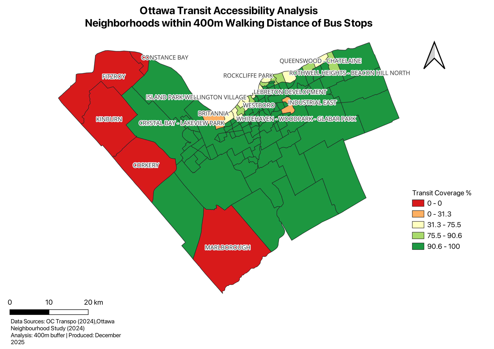

# ottawa-transit-accessibility
GIS analysis identifying underserved neighbourhoods for OC Transpo service expansion prioritization



---

## 📋 Project Overview

**Research Question:** Which Ottawa neighbourhoods have the poorest access to public transit, and where should OC Transpo prioritize service expansion?

**Key Finding:** 5 neighbourhoods (4.3%) have zero transit access, and approximately 15 neighborhoods have poor-to-critical coverage (<75%), revealing significant spatial inequity in Ottawa's transit system.

**Analysis Impact:** Provides data-driven prioritization framework for $XX million in transit infrastructure investments.

---

## 🎯 Skills Demonstrated

- **Buffer Analysis** - 400m walking distance calculation
- **Spatial Intersection** - Coverage area computation
- **Field Calculation** - Percentage calculations with conditional logic
- **Data Prioritization** - Ranking 116 neighbourhoods by need
- **Professional Cartography** - Publication-ready maps with proper symbology
- **Actionable Insights** - Translating analysis into recommendations

---

## 🗺️ Methodology Summary

### Analysis Approach
1. **Buffer Creation:** 400-meter buffers around all OC Transpo bus stops (5-minute walk, industry standard)
2. **Service Area Calculation:** Dissolved overlapping buffers to create continuous coverage area
3. **Coverage Analysis:** Calculated percentage of each neighbourhood within transit access
4. **Prioritization:** Ranked neighbourhoods by coverage to identify priority areas

### Data Sources
- **OC Transpo Bus Stops** (2024) - Ottawa Open Data Portal
- **Ottawa Neighbourhood Boundaries** - Generation 3, Ottawa Neighbourhood Study (2024)
- **116 neighbourhoods analyzed**

### Tools
- **QGIS 3.X**
- **CRS:** EPSG:3857 (Web Mercator)

---

## 📊 Key Results

### Priority Tiers for Service Expansion

**Tier 1: Zero Access (5 neighbourhoods - 0% coverage)**
- Marlborough, Constance Bay, Kinburn, Corkery, Fitzroy
- **Location:** Rural/exurban periphery
- **Impact:** Complete vehicle dependency for residents

**Tier 2: Critically Underserved (3 neighbourhoods - <50% coverage)**
- Crystal Bay - Lakeview Park (31%)
- Industrial East (31%)
- Britannia (55%)
- **Impact:** Majority of residents lack convenient transit access

**Tier 3: Poor Access (15 neighbourhoods - 50-75% coverage)**
- Includes: Queenswood, Westboro, Island Park-Wellington Village, Lebreton Development
- **Impact:** Partial coverage creates accessibility gaps

**Urban Core: Excellent Coverage (90-100%)**
- Dense urban areas show near-universal transit access
- Demonstrates successful infrastructure in established neighbourhoods

---

## 💡 Recommendations

### Immediate Priority
- Evaluate rural transit solutions for zero-access neighbourhoods
- Consider on-demand shuttle services or ride-sharing partnerships

### High Priority  
- Expand routes to Crystal Bay - Lakeview Park and Industrial East
- Target 50%+ coverage in currently underserved areas

### Medium Priority
- Optimize existing routes to close gaps in 50-75% coverage neighbourhoods
- Focus on inner suburbs with growth potential

### Strategic Considerations
- Coordinate with urban development plans
- Evaluate service frequency (coverage ≠ adequate service)
- Consider equity impacts in prioritization

---

## 📁 Repository Contents
```
Project_2_Transit_Access/
├── README.md (this file)
├── methodology.md (detailed analysis workflow)
├── findings.md (complete results and recommendations)
├── Ottawa_Transit_Coverage_Map.png (final visualization)

```

---

## 🔗 Full Documentation

- **[Complete Methodology](methodology.pdf)** - Full analysis workflow, assumptions, and limitations
- **[Detailed Findings](findings.pdf)** - Comprehensive results and recommendations
---

## 🎯 Portfolio Context

**Project 2 of 10** - GIS Portfolio for Entry-Level Analyst Positions  
**Completed:** December 2025  
**Timeline:** 5 days (planning, analysis, documentation)

**Demonstrates:**
- Real-world problem-solving
- Transportation planning analysis
- Spatial equity assessment
- Professional communication of technical findings

---

## 📫 Contact

**Prosper Ocheme**  
📧 ochemeprosper@gmail.com
💼 www.linkedin.com/in/prosper-ocheme-


---

## 📄 Data Attribution

- OC Transpo Bus Stop data: [Ottawa Open Data Portal](https://open.ottawa.ca/)
- Neighborhood boundaries: [Ottawa Neighbourhood Study](https://www.neighbourhoodstudy.ca/)

Analysis methodology and findings are original work.

---

*Built with QGIS | December 2025*
